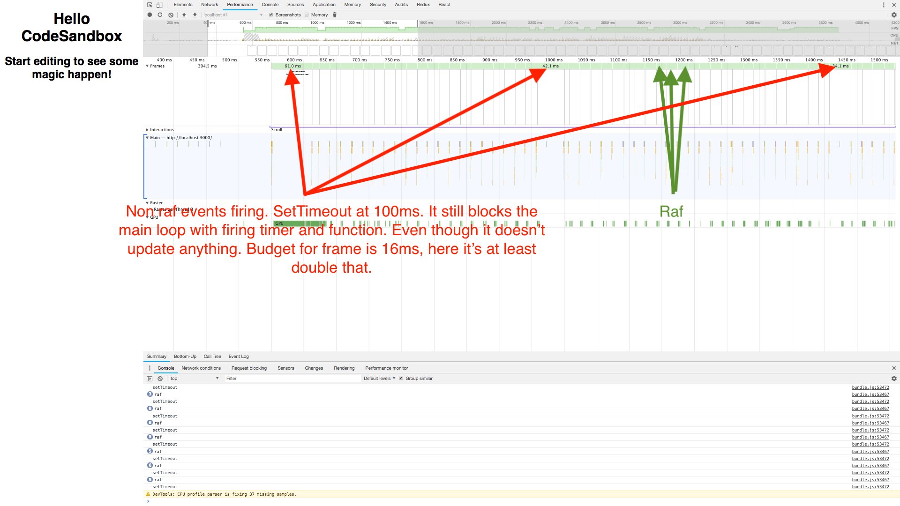

Why to use RAF?
===============

This a small example project showing why raf is better than setting setTimeout
manually. Main point is that setTimeout is scheduled in different event loop
which causes blocking for the update even if it's not affecting screen.

Steps to observe this.
```
$ npm start
```

open browser and open devtools performance panel. Start recording and then try
scrolling up and down. Stop recording. You will see that firing a timer made
frames last at least 30ms or more.


Blocking the update even in this small setup. Now imagine big app 😳
